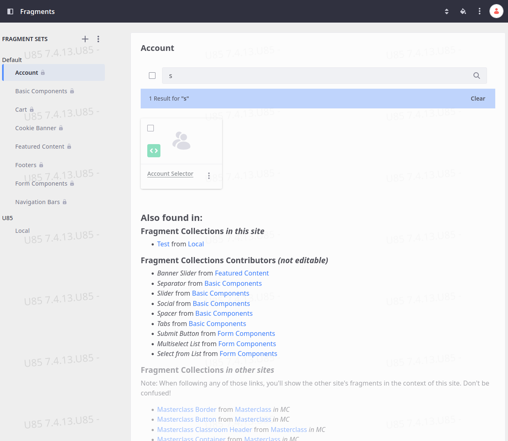

# Fragment Search (in Fragment Sets)

A simple spike project to solve [LPS-142817](https://liferay.atlassian.net/browse/LPS-142817) and [LPS-148905](https://liferay.atlassian.net/browse/LPS-148905), with a (as you expect from me) _very_ crude UI.

A proper UI would require to duplicate a lot of _internal_ classes from the original Fragment Administration, which I frowned upon, for an additional module. 

## How to use

Clone into a Liferay Workspace's `modules` directory and build. 

Tested on DXP 7.4 U85, but should work on almost every other build, as well as on Liferay CE.  For Liferay CE, set the appropriate dependency in this module's `build.gradle`. 

This plugin uses the target platform set in the workspace's `gradle.properties` (`liferay.workspace.product`)

## What you'll see

To show a few more results than usual, here's a search for all fragments containing the letter "s". Search is conducted within the "Account" Fragment Contributor - its
results are "first class" and unchanged - those are what you see without this plugin.

The "Also found in" section is the contribution of this plugin 

## To Do

* The plugin is hardcoded with english text
* It'd be nice to get a full UI with thumbnails for the other results. See introductory paragraph why this has not been attempted in an external module
* As it's a portlet filter that detects known markup from the original portlet, it might break any time that the original portlet changes its HTML markup.
* "Nobody will ever need more than 640 fragment collections" (hardcoded limit - so that it runs on DOS)
* Searching in other sites (new in 1.0.2) does not pay attention to permissions